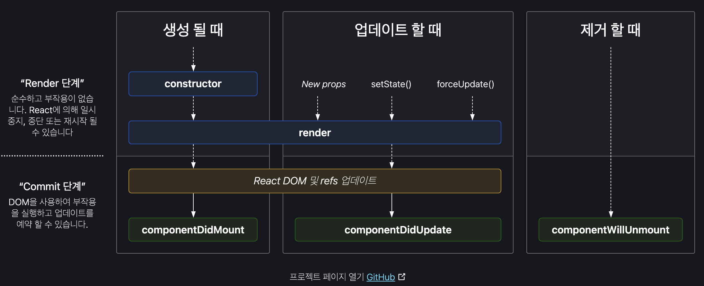
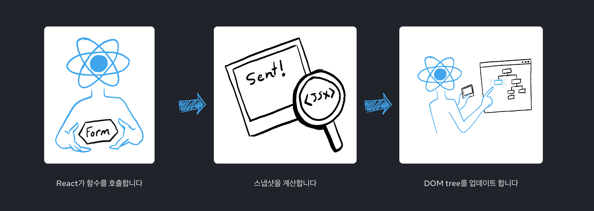

# 2.3 클래스형 컴포넌트와 함수형 컴포넌트

함수형 컴포넌트는 리액트 0.14 버전부터 만들어진 역사 깊은 컴포넌트 선언 방식이다. <br>
이때는 `무상태 함수형 컴포넌트`라고 해서, 별도의 상태 없이 단순히 어떤 요소를 정적으로 렌더링 하는 것이 목적이었다.<br>

리액트 16.8 버전에서 Hooks라는 기능이 도입되면서 함수형 컴포넌트에서도 상태를 관리할 수 있게 되었다.<br>
이에 따라 기존의 클래스형 컴포넌트 방식 중 어떤 것을 사용해야할지 많은 혼란이 있었다.

## 2.3.1 클래스형 컴포넌트

여느 언어들처럼 리액트 클래스 컴포넌트도 constructor 메서드를 사용하여 초기화를 할 수 있다.<br>
이후, ES2022에 도입된 클래스 필드 문법을 사용하면 constructor 메서드를 생략할 수 있다.<br>
props, state, method 등을 클래스 필드로 선언할 수 있다.<br>

### 클래스형 컴포넌트의 생명주기 메서드

클래스형 컴포넌트를 사용하며 가장 자주 언급되는 것이 `생명주기`이다.

생명주기 메서드가 실행되는 시점은 크게 3가지로 나눌 수 있다.

- 마운트 : 컴포넌트가 **생성**되는 시점.
- 업데이트 : 이미 생성된 컴포넌트의 내용이 업데이트 되는 시점.
- 언마운트 : 컴포넌트가 더 이상 존재하지 않는 시점.

<br>

### 리액트 생명주기 다이어그램



<br>

### 클래스형 컴포넌트의 한계

클래스 컴포넌트만으로도 완성도 있는 리액트 앱을 만들 수 있지만, 왜 함수 컴포넌트를 만들었을까? <br>
이유는 다음과 같다.

- 데이터 흐름을 추적하기 어렵다.
- 앱 내부 로직 재사용이 어렵다.
- 기능이 많아질수록 컴포넌트 크기가 커진다.
- 클래스는 함수에 비해 상대적으로 어렵다.
- 코드 길이가 더 길어질 수 있다.
- 핫 리로딩을 하는데 상대적으로 불리하다. <br>
  (핫 리로딩이란? 코드를 수정하면 브라우저에서 새로고침 없이 바로 수정된 내용을 볼 수 있는 기능)

count라는 state를 1만큼 올려주는 핸들러로 구성된 동일한 기능의 클래스형 컴포넌트와 함수형 컴포넌트가 있다고 해보자. <br>
이 코드를 개발자 모드에서 실행한 후, return 과 render 함수 내부를 수정하면<br>
함수형 컴포넌트는 핫 리로딩이 일어난 후에도 변경된 상태값이 유지되지만, <br>
클래스형 컴포넌트는 핫 리로딩이 일어나면서 state가 기본 값으로 초기화된다.

클래스형 컴포넌트는 최초 렌더링 시 instance를 생성한 후 그 내부에서 state를 관리한다.<br>
이 instance 내부에 있는 render를 수정하면, 이를 반영하는 방법은 오직 새 instance를 생성하는 것 뿐이다.<br>
때문에 state가 기본 값으로 초기화된다. <br>

반면, 함수형 컴포넌트는 state를 함수가 아닌 클로저에 저장해둔다.<br>
때문에 함수가 다시 실행되도 초기화 되지 않는다.

## 2.3.2 함수형 컴포넌트

클래스형 컴포넌트와는 다르게, render 내부에서 필요한 함수를 선언할 때 this 바인딩을 조심하지 않아도 되고, <br>
state는 객체가 아닌 각각의 원시값으로 관리할 수 있고, 렌더링 하는 곳인 return 에서도 굳이 this를 사용하지 않아도 props와 state에 접근할 수 있다는 장점이 있다.

## 2.3.3 함수형 컴포넌트 vs 클래스형 컴포넌트

### 생명주기 메서드의 부재

함수형 컴포넌트는 생명주기 메서드가 존재하지 않는다.

클래스형 컴포넌트는 extends로, render함수가 있는 React.Component를 상속 받기 때문이다. <br>
반면 함수형 컴포넌트는 단지 props를 받아와 단순 리액트 요소만 반환하는 함수이다.

다만, 함수형 컴포넌트도 useEffect 훅을 통해 생명주기 메서드와 ' 유사 '한 효과를 낼 수 있다.

<br>

### 함수형 컴포넌트와 렌더링된 값

클래스형 컴포넌트는 시간의 흐름에 따라 변화하는 this.state를 기준으로 렌더링이 일어난다.<br>
예를 들어, setTimeout() 함수를 사용하여, 3초 뒤 현재 state를 리턴하는 함수가 있다고 가정하자. <br>
이 3초 사이에 state를 변경하면, 클래스 컴포넌트는 this를 기준으로 렌더링하기에, 변경된 값을 리턴한다.

그러나 함수형 컴포넌트는 state를 변경하여도 이전 state 값을 리턴한다. <br>

<br>

왜 그럴까 ?

이는 클로저(closure)의 개념과 밀접하게 관련이 있다. <br>
리액트의 함수형 컴포넌트에서는 각 렌더링마다 해당 컴포넌트의 Props와 State의 특정 '스냅샷'이 생성된다. <br>
이는 함수형 컴포넌트의 실행이 완료된 후에도 해당 실행 당시의 Props와 State 값을 '기억'하는 클로저가 형성되기 때문이다.

해당 시점에서의 Props와 State는 그 실행 컨텍스트에 고유하다. <br>
즉, 컴포넌트의 각 렌더링은 독립적인 실행 인스턴스로 볼 수 있으며, 각 인스턴스는 자신이 생성될 때의 Props와 State 값을 가지고 있다.

이벤트 핸들러의 경우에 대해서도 알아보자. <br>
컴포넌트 내부에서 정의된 이벤트 핸들러는, 해당 핸들러가 생성된 렌더링 시점의 Props와 State에 접근한다.<br>
예를 들어, 버튼 Click 핸들러 내에서 State 값을 참조한다면, 그 핸들러는 해당 State의 값을 그 시점에서 '스냅샷'으로 가진다. <br>
이후에 State가 변경되어도, 이미 생성된 핸들러는 원래의 State 값을 '기억'한다.

state 변수는 읽고 쓸 수 있는 일반 자바스크립트 변수처럼 보일 수 있지만, state는 스냅샷처럼 동작한다. <br>
state 변수를 설정하여도 이미 가지고 있는 state 변수는 변경되지 않고, 대신 `리렌더링`이 발동된다.

### 렌더링 이란?

React가 컴포넌트, 즉 함수를 호출한다는 뜻. <br>
prop, 이벤트 핸들러, 로컬 변수는 모두 렌더링 당시의 state를 사용해 계산된다.

리액트가 컴포넌트를 리렌더링 할 때,

1. React가 함수를 다시 호출한다.
2. 함수가 새로운 JSX 스냅샷을 반환한다.
3. 그러면 React가 함수가 반환한 스냅샷과 일치하도록 화면을 업데이트한다.



앞서 말했듯, state는 실제로 함수 외부에 마치 선반에 있는 것처럼 React 자체에 `존재`한다. <br>
React가 컴포넌트를 호출하면 특정 렌더링에 대한 state의 스냅샷을 제공한다. <br>

컴포넌트는 `해당 렌더링의 state 값을 사용해` 계산된 새로운 props 세트와 이벤트 핸들러가 포함된 UI의 스냅샷을 JSX에 반환한다!

```jsx
import { useState } from "react";

export default function Counter() {
  const [number, setNumber] = useState(0);

  return (
    <>
      <h1>{number}</h1>
      <button
        onClick={() => {
          setNumber(number + 1);
          setNumber(number + 1);
          setNumber(number + 1);
        }}
      >
        +3
      </button>
    </>
  );
}
```

다음과 같은 코드에서, 버튼을 클릭해도 숫자가 3씩 증가하지 않는다. <br>
`state를 설정하면 다음 렌더링에 대해서만 변경되기 때문.`

처음 컴포넌트가 렌더링 된 후, number는 0이다. <br>
때문에 해당 렌더링의 onClick 핸들러에서 setNumber(number + 1)가 호출된 후에도 number의 값은 여전히 0 이다.

리액트는 state인 number를 즉시 +1 하는 것이 아닌, `다음 렌더링에서 number를 1로 변경할 준비를 한다.`

<br>

```jsx
import { useEffect, useState } from "react";

function App() {
  const [count, setCount] = useState(0);

  useEffect(() => {
    console.log(`You clicked ${count} times`); // 이 효과가 실행될 때의 count 값
  }, [count]);

  return (
    <button
      onClick={() => {
        setCount((prev) => prev + 1);
        console.log("Current count is", count);
      }}
    >
      Click me!
    </button>
  );
}

export default App;
```

때문에 위 코드도 console.log 결과값이 +1 증가하기 전 값이 나온다.

state 변수의 값은 `이벤트 핸들러의 코드가 비동기적이더라도`, `렌더링 내에서 절대 변경되지 않는다.`
